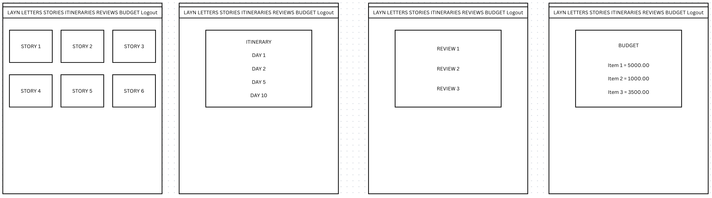
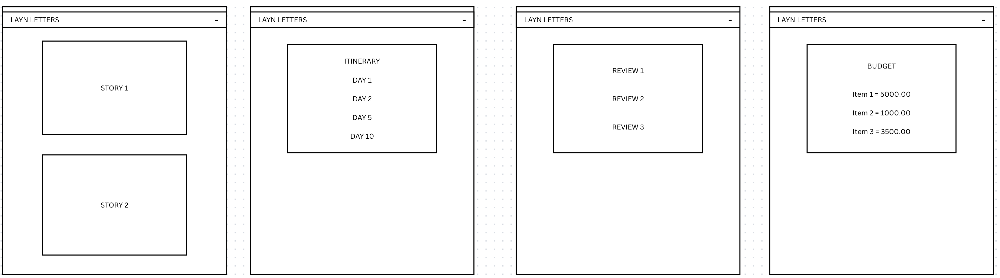

# Layn Letters — Travel Blog Platform

Layn Letters is a web-based travel blog platform where a visitor can view travel stories, itineraries, and reviews. Visitors can also comment, vote on comments, and create their own travel budgets using a live JavaScript calculator. The project was built with Python (Django), HTML, CSS,
JavaScript, deployed in Heroku and uses PostgreSQL in production.

---

## Live Website

## Table of Contents

- [Layn Letters — Travel Stories Platform](#layn-letters--travel-stories-platform)
  - [Project Overview](#project-overview)
  - [Live Website](#live-website)
  - [User Goals and Stories](#user-goals-and-stories)
    - [User Goals](#user-goals)
    - [Site Owner (Business) Goals](#site-owner-business-goals)
    - [User Stories](#user-stories)
  - [Design](#design)
    - [Structure and Layout](#structure-and-layout)
    - [Typography](#typography)
    - [Wireframes](#wireframes)
    - [Entity Relationship Diagram](#entity-relationship-diagram)
  - [Development and Agile Methodology](#development-and-agile-methodology)
    - [User Stories](#user-stories)
  - [Technologies Used](#technologies-used)
  - [Features](#features)
    - [Core](#core)
    - [Stories](#stories)
    - [Itineraries](#itineraries)
    - [Reviews](#reviews)
    - [Budgets](#budgets)
    - [Security and Permissions](#security-and-permissions)
  - [CRUD Summary](#crud-summary)
  - [Testing](#testing)
  - [Known Issues and Fixes](#known-issues-and-fixes)
  - [Security](#security)
  - [Deployment](#deployment)
  - [Local Development](#local-development)
  - [Version Control](#version-control)
  - [Credits](#credits)
  - [License](#license)

## User Goals and Stories

### User Goals
As a user I want to:
- View travel stories, itineraries, and reviews.
- Comment on published stories and reviews.
- Up/downvote comments for relevant and helpful discussion.
- Create, edit, and delete my own budgets to estimate trip costs.

### Site Owner (Business) Goals
As the site owner I want to:
- Publish my own travel stories, itineraries, and reviews.
- Retain control of publishing (visitors cannot publish stories/reviews).
- Encourage interaction through comments and votes.
- Offer a simple budgeting tool visitors can save and update.

### User Stories
(see Projects in Github) https://github.com/limcaroline/layn-letters/

---

## Design

### Structure and Layout
- Global navigation bar with links to Home, Stories, Itineraries, Reviews, Budgets.
- Consistent header, content area, and footer using Django.
- Grid layout for lists

### Typography
- Google Fonts 
- Font choices aim for a clean, travel editorial style.

### Wireframes
- Mobile, tablet, and desktop wireframes included under:

  Wireframe for large screens
  

  Wireframe for tablets and mobile
  

---

## Development and Agile Methodology

This project followed a simple agile workflow of Git commits and a project board also in Github.

### User Stories

## Technologies Used

- Python, Django
- HTML5, CSS, JavaScript
- Bootstrap 5
- SQLite (development), PostgreSQL (production)
- Django Allauth for authentication
- WhiteNoise for static files
- Pillow for ImageField support
- Git and GitHub for version control
- Heroku for deployment
- Cloudinary for storage

---

## Features

### Navigation
- home, stories, itineraries, reviews, budgets, accounts.
- Media uploads for story cover images.

### Stories
- Owner-only create/edit/delete.
- Public list and detail views with cover image and date.
- Commenting available to authenticated users.

### Itineraries
- Owner-only create/edit/delete.
- Inline formset for itinerary items; items grouped by day on display.

### Reviews
- Owner-only create/edit/delete reviews, with Places catalog.
- Rating field and visited_on date with YYYY-MM-DD input.
- Commenting and comment voting available to authenticated users.

### Budgets
- Authenticated visitors can create/edit/delete their own budgets.

---

## CRUD Summary

| Feature      | Create             | Read         | Update            | Delete            |
|--------------|--------------------|--------------|-------------------|-------------------|
| Stories      | Owner only         | All users    | Owner only        | Owner only        |
| Itineraries  | Owner only         | All users    | Owner only        | Owner only        |
| Reviews      | Owner only         | All users    | Owner only        | Owner only        |
| Budgets      | Authenticated user | All users    | Budget author     | Budget author     |
| Comments     | Authenticated user | All users    | Comment author    | Comment author    |
| Votes        | Authenticated user | Counts shown | Toggle by voter   | Toggle by voter   |

---

## Future Enhancements
Budgets
- Live total calculation via JavaScript.

## Testing

A complete manual testing log with scenarios, steps, and outcomes is provided in:
- TESTING.md

Summary:
- Navigation tested on mobile and desktop.
- CRUD flows verified for Stories (owner), Itineraries (owner), Reviews (owner),
  Budgets (visitor).
- Comments and voting verified.
- Image upload verified in development.
- HTML, CSS, JS, and Python validated using W3C/Jigsaw/JSHint/Flake8.
- Lighthouse and WAVE checks conducted for accessibility and best practices.

---

## Known Issues and Fixes
- Date input format confusion:
  - Enforced YYYY-MM-DD, added server-side validation, and UI max=today for visited_on.

---

## Security

- `SECRET_KEY`, `DATABASE_URL`, and other secrets via environment variables.
- `DEBUG=False` in production; `ALLOWED_HOSTS` and `CSRF_TRUSTED_ORIGINS` set.
- Authentication and authorization applied to all create/update/delete views.

---

## Deployment

Prerequisites:
- Heroku account and CLI (optional CLI path)
- GitHub repository connected to Heroku

Steps:
1) Push code
git add .
git commit -m "Deploy"
git push

2) Heroku dashboard
- Create new app (unique name).
- Settings -> Buildpacks -> heroku/python.
- Add-ons -> Heroku Postgres (Free).
- Settings -> Config Vars:
  - SECRET_KEY = 
  - DEBUG = off
  - ALLOWED_HOSTS = layn-letters.herokuapp.com
  - CSRF_TRUSTED_ORIGINS = https://layn-letters.herokuapp.com

3) Deploy Tab
- Connect to GitHub repo and Deploy branch.

4) Post-deploy console
python manage.py migrate
python manage.py createsuperuser
python manage.py collectstatic --noinput

5) Smoke test
- Visit the live URL.
- Log into /admin/, create sample data, verify pages.

---

## Local Development

Clone:
git clone https://github.com/limcaroline/layn-letters.git
cd layn-letters
python3 -m venv .venv
source .venv/bin/activate
pip install -r requirements.txt

Environment:
- Create `.env` (not committed) with:
SECRET_KEY=dev-insecure
DEBUG=on
ALLOWED_HOSTS=.localhost,127.0.0.1

Run:
python manage.py migrate
python manage.py createsuperuser
python manage.py runserver

Open: http://127.0.0.1:8000/

---

## Version Control

- Small, frequent commits for each feature or fix.
- Clear, descriptive commit messages.
- No secrets committed to the repository.

---

## Credits

- Django documentation and Bootstrap documentation.
- Validator tools: W3C, Jigsaw, JSHint, Flake8.
- Code Insitute modules and materials
- StackOverflow https://stackoverflow.com/
- Django documentation https://docs.djangoproject.com/en/5.2/ 
- w3schools for python tutorials and materials https://www.w3schools.com/ 
- learnpython.org for python tutorials and materials https://www.learnpython.org/
- ChatGPT by OpenAI for assistance with ideas, debugging, documentation, wording, code refactoring